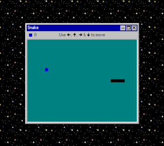

# Snake

A vanilla TypeScript game



## Prerequesites

To build and run the project, first install:
- NodeJS
- NPM

## Installation

To build the project, run:

```sh
npm install
npm run build
```

## Run

To run the game, serve the created `./dist/` directory on an HTTP server.

For example, you can use the `http-server` NPM package :

```sh
# Install http-server if you haven't installed it yet
npm install --global http-server

# Serve the ./dist directory. The -o option should open a web browser on http://127.0.0.1:9999
npx http-server ./dist/ -o -p 9999
```